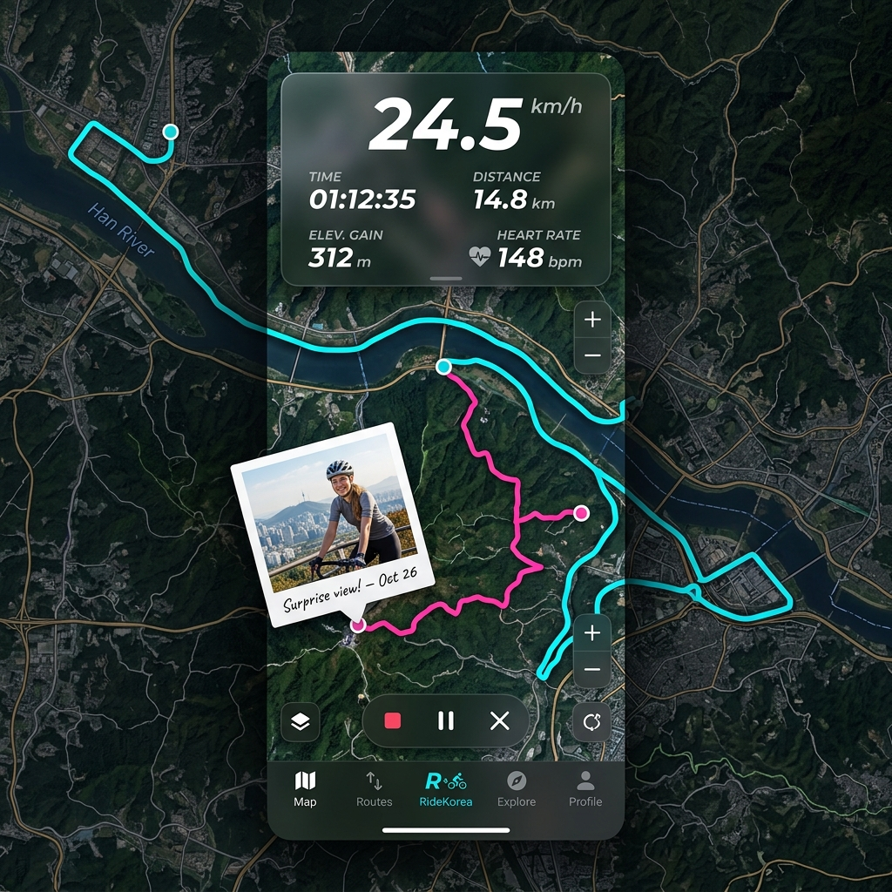
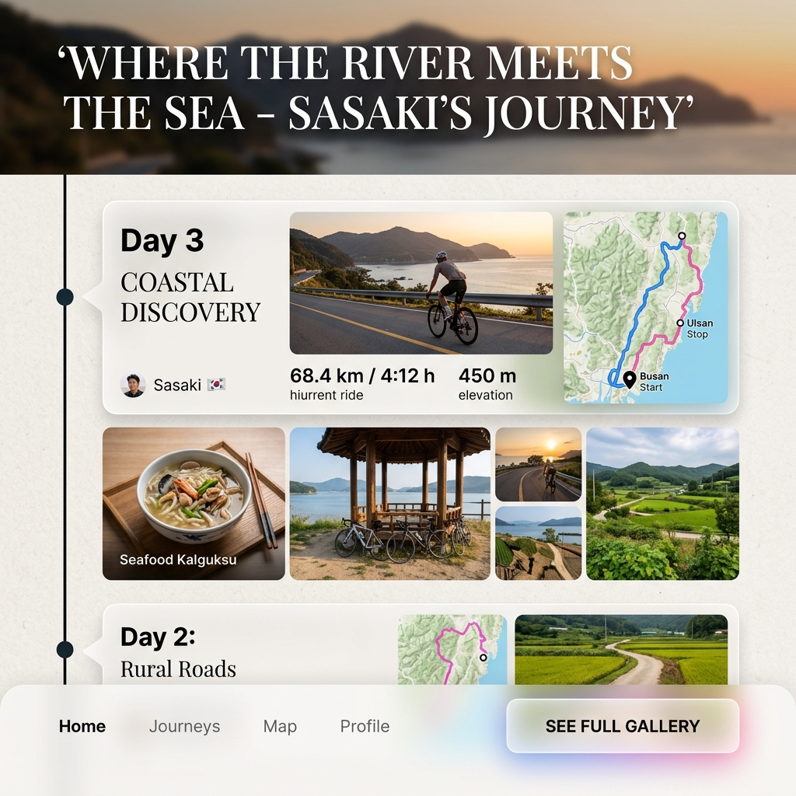

# 🚴‍♂️ RideKorea V3 디자인 제안: "Neo-Outdoors (역동성과 감수성의 융합)"

Codex의 투박하고 기계적인 UI를 벗어던지고, Claude가 만든 정석적이고 모던한 UI를 한 단계 더 뛰어넘는 **새로운 차원의 UI/UX 디자인 아이덴티티**를 제안합니다.

우리의 타겟인 '사사키'는 땀을 흘리며 페달을 밟는 **[역동적인 스포츠맨]**이면서, 동시에 한국의 낯선 풍경과 사람들을 가슴에 담는 **[감수성 풍부한 여행작가]**입니다. 이 서로 다른 두 영역을 하나의 스크린에서 완벽하게 조화시키는 **"Neo-Outdoors (네오 아웃도어)"** 콘셉트를 생성된 UI 목업과 함께 소개합니다!

---

## 📸 1. 시각적 UI 목업 제안 (Visual Mockups)

````carousel

<!-- slide -->

````

---

## ⚡ 2. [역동성 (Dynamism)]을 폭발시키는 디자인 규칙

1. **에너지 반응형 타이포그래피 (Energy-Reactive Typography)**
   * 속도(`km/h`), 고도(`m`), 경사도(`%`)와 같은 스포츠 데이터는 일반 폰트가 아닌 **이탤릭체로 기울어진 역동적인 폰트(Racing Sans / Inter Black Italic)**를 사용해 스피드감을 극대화합니다.
2. **살아 숨 쉬는 궤적 (Pulsing Neon Tracks)**
   * 정해진 기본 경로는 **일렉트릭 사이언(Electric Cyan, 형광 파랑)**으로 렌더링하고, 사사키가 길을 잃거나 새로운 로컬 맛집을 찾아 이탈한 궤적은 **네온 어드벤처 핑크(Neon Pink)**로 빛나게 표시합니다. 두 경로가 교차할 때 부드러운 그라데이션이 발생해 주행의 흥분을 돋웁니다.
3. **지형 높낮이에 반응하는 대시보드 글로우 (Elevation Glow)**
   * 오르막길(Hill Climb)에 진입하면 화면 상단의 글래스모피즘 HUD 가장자리에 열정을 상징하는 따뜻한 오렌지빛 앰비언트 글로우(Glow)가 미세하게 감돕니다. 평지에서는 차분한 블루 톤을 유지합니다.

---

## 🍂 3. [아날로그 감수성 (Sensibility)]을 담아내는 UX 혁신

1. **지도 위의 '폴라로이드 필름' 스팟 마커 (Instant Polaroid Pins)**
   * 일반 지도 앱(구글, 카카오)의 딱딱한 '빨간색 핀(📍)'을 완전히 버립니다!
   * 라이더가 주행 중 찍은 사진은 지도 위에 **아날로그 폴라로이드 필름 프레임** 형태로 기울어져 꽂힙니다. 프레임 하단에는 사사키가 남긴 감상평이 **손글씨 스타일의 폰트**로 표기되어, 지도를 확대할 때마다 누군가의 추억 앨범을 넘겨보는 듯한 감동을 줍니다.
2. **디지털 여행 매거진 레이아웃 (Editorial Diary)**
   * 주행이 끝난 후 제공되는 'Diary(기록)' 탭은 차가운 통계 그래프가 아닙니다. 마치 감성 여행 잡지(Kinfolk, Lonely Planet)를 읽는 듯한 **에디토리얼 레이아웃**을 채택합니다.
   * *"어디에서 밥을 먹었고, 어디서 타이어를 때웠는지"*가 고품질 사진, 지도 조각과 함께 타임라인 기사처럼 아름답게 엮입니다.
3. **시간과 날씨를 반영하는 '선셋 글래스' (Sunset Glassmorphism)**
   * 시간에 따라 UI 패널의 투명한 배경색이 변합니다. 해가 지는 금강 강변을 달릴 때(노을 시간대), 화면 내 인터페이스 카드들은 따뜻한 로즈골드와 호박색(Amber) 빛을 머금는 **선셋 글래스** 효과로 변모하여 여행자의 감수성을 극적으로 끌어올립니다.

---

## 💡 4. Codex vs Claude vs [RideKorea V3] 비교 요약

| 요소 | Codex (`RideKorea`) | Claude (`RideKorea_b`) | 🔥 제안: **RideKorea V3 (Neo-Outdoors)** |
| :--- | :--- | :--- | :--- |
| **전체 느낌** | 복잡한 기능 중심의 대시보드 | 정돈되고 깔끔한 모던 앱 | **에너지 넘치는 스포츠 기기 + 감성 매거진** |
| **사진 핀** | 일반적인 지도 마커에 아이콘 추가 | 둥근 프로필/썸네일 핀 | **손글씨 캡션이 달린 아날로그 폴라로이드 프레임** |
| **주행 속도계** | 일반 텍스트 폰트 | 가독성 좋은 정자체 숫자 | **스피드감이 느껴지는 이탤릭 블랙 스포츠 폰트** |
| **경로 이탈** | 파란선 / 핑크선 단순 분리 | 명확하고 세련된 색상 분리 | **네온 그라데이션이 살아 움직이는 생동감 넘치는 라인** |

이 디자인 콘셉트는 기술적으로는 현재 Claude가 구현한 `src/theme/theme.ts`와 `RideMap` 구조 위에 바로 입힐 수 있으면서도, 사용자에게는 완전히 다른 **'가슴 뛰는 여행'**을 선사할 것입니다! 어떠신가요?
