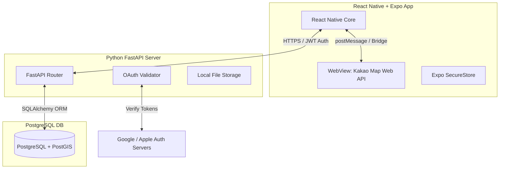

# RideKorea 구축 단계별 설계 및 아키텍처 정의서

본 문서는 외국인 라이더를 위한 자전거 종주 앱 **RideKorea**의 기술 아키텍처 및 단계별 세부 설계 사항을 정의한다. 
지도 엔진(카카오맵 API)을 제외한 모든 구성 요소(Python, PostgreSQL/PostGIS 등)는 오픈소스 기반으로 설계되었다.

---

## 1. 기술 아키텍처 개요

RideKorea는 클라이언트(React Native 앱)와 백엔드 API 서버(FastAPI)가 통신하는 구조이며, 지도는 카카오 웹 지도를 WebView를 통해 내장하여 구동한다.



### 아키텍처 구성 요소
1. **Frontend**: React Native (Expo)
   - 모바일 플랫폼(iOS, Android) 대응.
   - 카카오 지도는 Expo WebView 내에서 로컬/웹 HTML 파일로 실행하며 양방향 통신 브릿지 구현.
   - 소셜 로그인 토큰 및 JWT는 `expo-secure-store`에 암호화하여 로컬 저장.
2. **Backend**: Python FastAPI (Uvicorn)
   - 높은 비동기 I/O 성능 및 자동 OpenAPI 문서화 지원.
   - SQLAlchemy(ORM) 및 Alembic(마이그레이션) 적용.
   - 구글/애플 인증 서버와 직접 연동하여 소셜 로그인 검증 수행.
3. **Database**: PostgreSQL + PostGIS Extension
   - 지리 좌표(경위도)와 자전거 경로 선형 데이터를 공간 연산으로 효율적으로 처리하기 위해 PostGIS 확장팩 탑재.
4. **Storage**: FastAPI Static Mount (오픈소스 로컬 저장소)
   - 다이어리용 업로드 이미지는 우선 백엔드 서버의 로컬 특정 디렉터리에 업로드하고, FastAPI의 Static Files 마운트를 통해 직접 서빙. (프로덕션 배포 시 MinIO 등 오픈소스 S3 호환 스토리지로 변경 용이하게 설계)

---

## 2. 데이터베이스 스키마 설계 (PostgreSQL + PostGIS)

PostgreSQL의 `GEOGRAPHY` 타입을 사용하여 공간 인덱스를 활용할 수 있도록 설계한다.

```sql
-- 1. PostGIS 확장 활성화
CREATE EXTENSION IF NOT EXISTS postgis;

-- 2. 사용자 프로필 테이블 (소셜 가입자 정보 관리)
CREATE TABLE IF NOT EXISTS public.users (
    id UUID PRIMARY KEY DEFAULT gen_random_uuid(),
    social_id TEXT UNIQUE NOT NULL,       -- Google/Apple의 sub 또는 user_id
    provider TEXT NOT NULL CHECK (provider IN ('google', 'apple')),
    email TEXT UNIQUE NOT NULL,
    display_name TEXT,
    profile_photo_url TEXT,
    preferred_language VARCHAR(5) DEFAULT 'en',
    created_at TIMESTAMP WITH TIME ZONE DEFAULT CURRENT_TIMESTAMP NOT NULL,
    updated_at TIMESTAMP WITH TIME ZONE DEFAULT CURRENT_TIMESTAMP NOT NULL
);

-- 3. 자전거 종주 코스 테이블
CREATE TABLE IF NOT EXISTS public.courses (
    id UUID PRIMARY KEY DEFAULT gen_random_uuid(),
    name TEXT NOT NULL,                  -- 국문명 (예: 국토종주 자전거길)
    name_en TEXT NOT NULL,               -- 영문명 (예: Cross-Country Route)
    description TEXT,
    description_en TEXT,
    distance_km NUMERIC(5, 2) NOT NULL,
    estimated_days_min INT NOT NULL,
    estimated_days_max INT NOT NULL,
    difficulty VARCHAR(10) CHECK (difficulty IN ('easy', 'medium', 'hard')),
    route_geometry GEOMETRY(LineString, 4326) NOT NULL, -- GPX/GeoJSON에서 변환된 경로 선형 데이터
    created_at TIMESTAMP WITH TIME ZONE DEFAULT CURRENT_TIMESTAMP NOT NULL
);

-- 공간 쿼리 최적화를 위한 공간 인덱스 생성
CREATE INDEX IF NOT EXISTS courses_geom_idx ON public.courses USING GIST (route_geometry);

-- 4. 경로 주변 주요 스팟 테이블 (인증센터, 자전거샵 등)
CREATE TABLE IF NOT EXISTS public.spots (
    id UUID PRIMARY KEY DEFAULT gen_random_uuid(),
    course_id UUID REFERENCES public.courses(id) ON DELETE CASCADE,
    name TEXT NOT NULL,
    name_en TEXT NOT NULL,
    type VARCHAR(30) NOT NULL,           -- 'certification_center', 'bicycle_shop', 'repair', 'lodging' 등
    location GEOGRAPHY(Point, 4326) NOT NULL, -- Point 경위도
    description TEXT,
    description_en TEXT,
    created_at TIMESTAMP WITH TIME ZONE DEFAULT CURRENT_TIMESTAMP NOT NULL
);

CREATE INDEX IF NOT EXISTS spots_location_idx ON public.spots USING GIST (location);

-- 5. 라이딩 기록 (Journeys) 테이블
CREATE TABLE IF NOT EXISTS public.journeys (
    id UUID PRIMARY KEY DEFAULT gen_random_uuid(),
    user_id UUID REFERENCES public.users(id) ON DELETE CASCADE NOT NULL,
    course_id UUID REFERENCES public.courses(id) ON DELETE SET NULL,
    title TEXT NOT NULL,
    status VARCHAR(15) DEFAULT 'planning' CHECK (status IN ('planning', 'riding', 'completed', 'paused')),
    started_at TIMESTAMP WITH TIME ZONE,
    completed_at TIMESTAMP WITH TIME ZONE,
    visibility VARCHAR(10) DEFAULT 'private' CHECK (visibility IN ('private', 'public')),
    created_at TIMESTAMP WITH TIME ZONE DEFAULT CURRENT_TIMESTAMP NOT NULL
);

-- 6. 스팟 다이어리 테이블 (종주 기록 중 남기는 사진/메모)
CREATE TABLE IF NOT EXISTS public.spot_diaries (
    id UUID PRIMARY KEY DEFAULT gen_random_uuid(),
    journey_id UUID REFERENCES public.journeys(id) ON DELETE CASCADE NOT NULL,
    spot_id UUID REFERENCES public.spots(id) ON DELETE SET NULL,
    user_id UUID REFERENCES public.users(id) ON DELETE CASCADE NOT NULL,
    diary_text TEXT,
    photo_urls TEXT[],                    -- 업로드된 이미지 URL 목록 배열
    visited_at TIMESTAMP WITH TIME ZONE DEFAULT CURRENT_TIMESTAMP NOT NULL,
    visibility VARCHAR(10) DEFAULT 'private' CHECK (visibility IN ('private', 'public')),
    created_at TIMESTAMP WITH TIME ZONE DEFAULT CURRENT_TIMESTAMP NOT NULL
);
```

---

## 3. 핵심 기능 설계 및 통신 규격

### 3.1 카카오 지도 WebView Bridge 통신 프로토콜
React Native와 WebView(HTML/JS) 간의 상태 연동을 위해 다음 규격을 사용한다.

#### 1) React Native -> WebView (명령 전송)
React Native에서 `webviewRef.current.postMessage(JSON.stringify(payload))` 형태로 메시지를 발송한다.

- **지도 초기화 및 설정**
  ```json
  {
    "type": "INIT_MAP",
    "center": { "lat": 37.56682, "lng": 126.97865 },
    "level": 5
  }
  ```
- **코스 경로 드로잉**
  ```json
  {
    "type": "DRAW_ROUTE",
    "routeId": "course-uuid",
    "path": [
      {"lat": 37.5668, "lng": 126.9786},
      {"lat": 37.5650, "lng": 126.9790}
    ]
  }
  ```
- **스팟 마커 추가**
  ```json
  {
    "type": "SET_SPOTS",
    "spots": [
      {
        "id": "spot-uuid",
        "name": "Ara West Sea Lock",
        "type": "certification_center",
        "lat": 37.5612,
        "lng": 126.7981
      }
    ]
  }
  ```

#### 2) WebView -> React Native (이벤트 통지)
WebView 내 JS에서 `window.ReactNativeWebView.postMessage(JSON.stringify(payload))`로 상위 앱에 보고한다.

- **지도 로딩 완료**
  ```json
  { "type": "MAP_LOADED" }
  ```
- **마커 클릭**
  ```json
  {
    "type": "MARKER_CLICKED",
    "spotId": "spot-uuid",
    "name": "Ara West Sea Lock"
  }
  ```

---

### 3.2 소셜 로그인 연동 시퀀스
사용자는 오직 소셜 로그인만을 통해 인증된다.

```
[ User ]        [ React Native App ]       [ FastAPI Backend ]      [ Google/Apple Server ]
   |                    |                           |                          |
   |-- 1. Click Login ->|                           |                          |
   |                    |-- 2. Request Social ID -->|                          |
   |                    |      Token or AuthCode    |                          |
   |                    |<-- 3. Return Tokens ------|                          |
   |                    |                           |                          |
   |                    |-- 4. Send ID Token ------>|                          |
   |                    |      to /api/v1/auth/     |                          |
   |                    |                           |-- 5. Verify ID Token --->|
   |                    |                           |<-- 6. User Info OK ------|
   |                    |                           |                          |
   |                    |                           |-- 7. Check/Create User --|
   |                    |                           |-- 8. Sign custom JWT ----|
   |                    |<-- 9. Return JWT Token ---|                          |
   |                    |   (RideKorea Auth)        |                          |
   |                    |                           |                          |
   |<- 10. Logged In ---|                           |                          |
```

---

## 4. 단계별 구축 및 설계 단계 (Roadmap)

### Phase 1: 개발 환경 및 인프라 구축 (Backend & DB)
1. **Docker 기반 데이터베이스 구성**:
   - `postgis/postgis:15-3.3` 공식 이미지를 활용한 `docker-compose.yml` 작성.
   - 로컬 데이터 폴더 마운트 및 한글/다국어 인코딩 설정.
2. **FastAPI 프로젝트 기본 골격 구성**:
   - 디렉터리 구성 및 가상환경(`requirements.txt`) 설정.
   - DB 커넥션 풀 설정 (`SQLAlchemy` 비동기 세션 적용).
   - Alembic 설정을 통한 최초 DB 스키마 마이그레이션 실행.
3. **오픈소스 미디어 스토리지 디렉터리 마운트**:
   - 서버 내부 `/app/uploads` 폴더 생성 및 FastAPI `StaticFiles` 마운트 적용.

### Phase 2: 데이터 수집 및 가공 (Data Engineering)
1. **자전거 행복나눔 서울-부산 코스 정보 파싱**:
   - GPX/GeoJSON 파일을 다운로드하여 `route_geometry` 타입으로 변환하는 파이썬 변환 스크립트 작성.
   - 변환된 데이터베이스 로더(`seeder`) 스크립트로 `courses` 테이블에 데이터 적재.
2. **인증센터 정보 추출**:
   - 인증센터 경위도 좌표, 주소, 영문명을 수집하여 `spots` 테이블에 `type='certification_center'`로 데이터 적재.

### Phase 3: 프론트엔드 기초 및 카카오 지도 연동 (App Base & Map)
1. **Expo React Native Boilerplate 구성**:
   - TypeScript 및 Expo Router 기반 프로젝트 구조 생성.
   - `react-native-webview` 패키지 설치.
2. **카카오 지도 브릿지용 HTML 파일 템플릿 개발**:
   - `assets/map.html` 작성 (카카오맵 Javascript API 로드 및 기본 맵 설정).
   - React Native의 WebView에서 로컬 HTML을 불러와 카카오맵 렌더링.
   - 선(Polyline) 그리기 기능과 마커 추가 기능, 클릭 이벤트 처리 브릿지 Javascript 작성.
3. **자체 GPX 오버레이 표시**:
   - 백엔드로부터 서울-부산 코스의 선 데이터(GeoJSON)를 받아 WebView 브릿지를 통해 카카오맵 위에 경로 라인을 그림.

### Phase 4: 소셜 로그인 및 사용자 인증 기능 구현 (Auth)
1. **OAuth 2.0 흐름 구현**:
   - React Native에서 `expo-auth-session` 등을 이용해 구글 및 애플 로그인 세션 호출 구현.
   - 취득한 `idToken`을 백엔드에 API 전송.
2. **FastAPI 소셜 로그인 처리 로직**:
   - `google-auth` 라이브러리 및 Apple JWT 공개키 서명을 사용하여 수신한 ID 토큰 유효성 검증.
   - 신규 사용자인 경우 `users` 테이블에 생성, 기존인 경우 로그인 정보 업데이트.
   - 백엔드 서명 키로 암호화된 짧은 만료 기간의 JWT 발급.
3. **API 접근 제어**:
   - FastAPI Dependency Injection(`Depends`)을 통해 API 호출 시 Authorization 헤더의 JWT가 유효한지 확인하는 공통 미들웨어 구현.

### Phase 5: 종주 기록 및 사진 다이어리 작성 (Features)
1. **종주 관리 API**:
   - 종주 시작(`status='riding'`), 일시정지, 완주 처리를 위한 REST API 설계.
2. **다이어리 작성 및 파일 업로드**:
   - 이미지 파일 업로드용 `multipart/form-data` 지원 API 추가.
   - 백엔드는 업로드된 파일을 고유 이름으로 저장하고 공용 접근 주소(URL) 리스트를 리턴.
   - 사용자가 작성한 메모(`diary_text`), 장소(`spot_id`), 사진 URL을 `spot_diaries` 테이블에 저장.
3. **앱 UI 구현**:
   - 종주 기록 시작하기 버튼 및 대시보드 화면.
   - 인증센터 마커를 탭했을 때 하단 모달(BottomSheet)을 통해 상세 정보와 다이어리 작성 폼 띄우기.

### Phase 6: 커뮤니티 지도 피드 및 테스트 (Deployment & Verification)
1. **공개 다이어리 지도 노출**:
   - 지도의 바운딩 박스(좌상단 LatLng ~ 우하단 LatLng) 범위 쿼리를 활용해, 다른 사용자가 `public`으로 올린 다이어리를 지도 마커로 뿌려주는 API 개발.
   - PostGIS의 `ST_MakeEnvelope` 함수 활용.
2. **실제 단말기 테스트**:
   - iOS 시뮬레이터 및 Android 에뮬레이터를 이용한 동작 상태 점검.
   - 카카오 지도 브리지 응답 속도 최적화.
